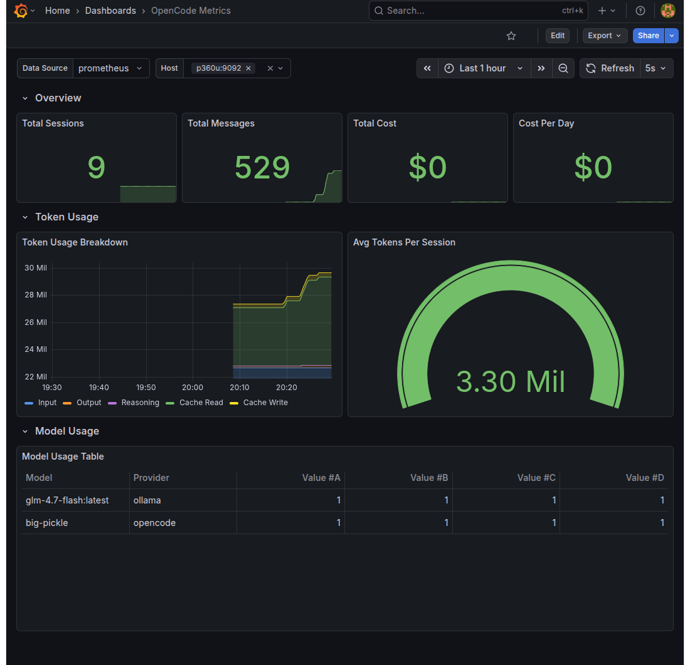

# OpenCode Prometheus Exporter

A Prometheus exporter for [OpenCode](https://opencode.ai) that collects metrics from the OpenCode SQLite database and exposes them for Prometheus scraping.

This project is made possible by **OpenCode** and its **Big Pickle** model, which provides the data source for all metrics.

## Features

- Collects session, message, token, and cost metrics
- Groups metrics by model and provider
- Exposes Prometheus-compatible `/metrics` endpoint
- Configurable scrape interval
- Multi-host filtering in Grafana dashboard

## Screenshot



## Requirements

- Docker
- Prometheus
- Grafana (optional, for visualization)
- OpenCode with SQLite database (OpenCode 1.2+)

## Quick Start

### 1. Build and Run

```bash
# Build and start the exporter
./start_opencode_exporter.sh
```

The exporter will:
- Build the Docker image
- Start the container as a daemon
- Mount your OpenCode database
- Expose metrics on port 9092

### 2. Configure Prometheus

Add to your `prometheus.yml`:

```yaml
- job_name: 'opencode'
  scrape_interval: 15s
  static_configs:
    - targets:
      - '192.168.1.100:9092'  # host1
      - '192.168.1.101:9092'  # host2
  relabel_configs:
    - source_labels: [__address__]
      regex: '192.168.1.100:9092'
      target_label: instance
      replacement: 'host1'
    - source_labels: [__address__]
      regex: '192.168.1.101:9092'
      target_label: instance
      replacement: 'host2'
```

The `instance` label is used by the Grafana dashboard for filtering by host.

### 3. Import Grafana Dashboard

Import `opencode_dashboard.json` into Grafana for pre-built visualizations.

## Metrics

| Metric | Type | Description |
|--------|------|-------------|
| `opencode_sessions_total` | Gauge | Total number of sessions |
| `opencode_messages_total` | Gauge | Total number of messages |
| `opencode_cost_total` | Gauge | Total cost in USD |
| `opencode_tokens_input_total` | Gauge | Total input tokens |
| `opencode_tokens_output_total` | Gauge | Total output tokens |
| `opencode_tokens_reasoning_total` | Gauge | Total reasoning tokens |
| `opencode_tokens_cache_read_total` | Gauge | Total cache read tokens |
| `opencode_tokens_cache_write_total` | Gauge | Total cache write tokens |
| `opencode_cost_per_day` | Gauge | Average cost per day |
| `opencode_tokens_per_session` | Gauge | Average tokens per session |
| `opencode_model_messages_total` | Gauge | Messages by model/provider |
| `opencode_model_cost_total` | Gauge | Cost by model/provider |
| `opencode_model_tokens_input_total` | Gauge | Input tokens by model/provider |
| `opencode_model_tokens_output_total` | Gauge | Output tokens by model/provider |

## Configuration

### Environment Variables

| Variable | Default | Description |
|----------|---------|-------------|
| `DB_PATH` | `/data/opencode.db` | Path to OpenCode SQLite database |

### Command Line Options

```bash
python exporter.py --db-path /path/to/opencode.db --port 9092 --interval 15
```

## Data Source

OpenCode stores data in `~/.local/share/opencode/opencode.db` (Linux/macOS).

The exporter mounts the host's home directory to access this database.

## Docker Details

- **Image**: `opencode-exporter`
- **Port**: 9092
- **Network**: Host mode (required for Prometheus to scrape)
- **Volume**: Mounts `$HOME` to access OpenCode database

## Acknowledgments

This project takes inspiration from [tokscale](https://github.com/junhoyeo/tokscale) for understanding OpenCode's data schema and metrics collection approach.

## License

MIT
